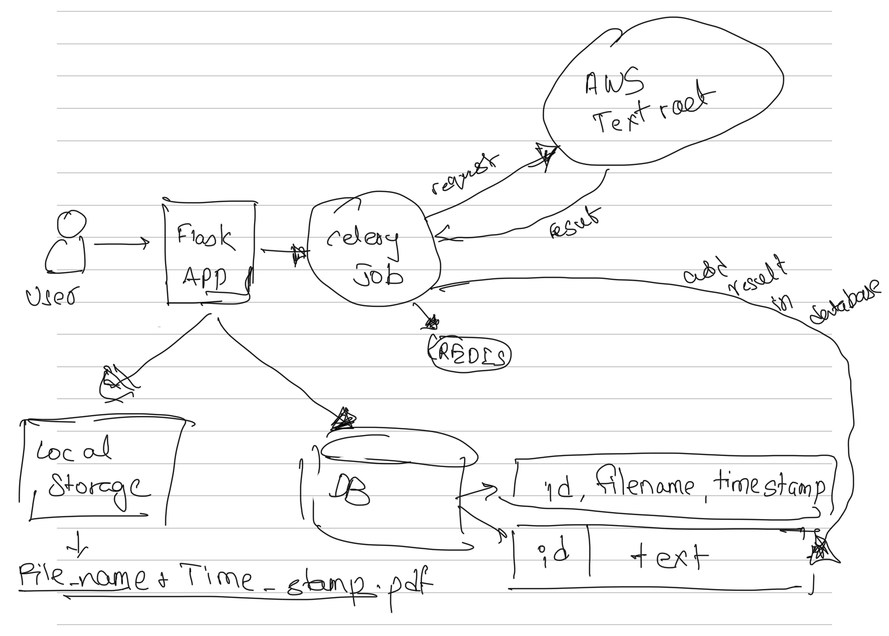
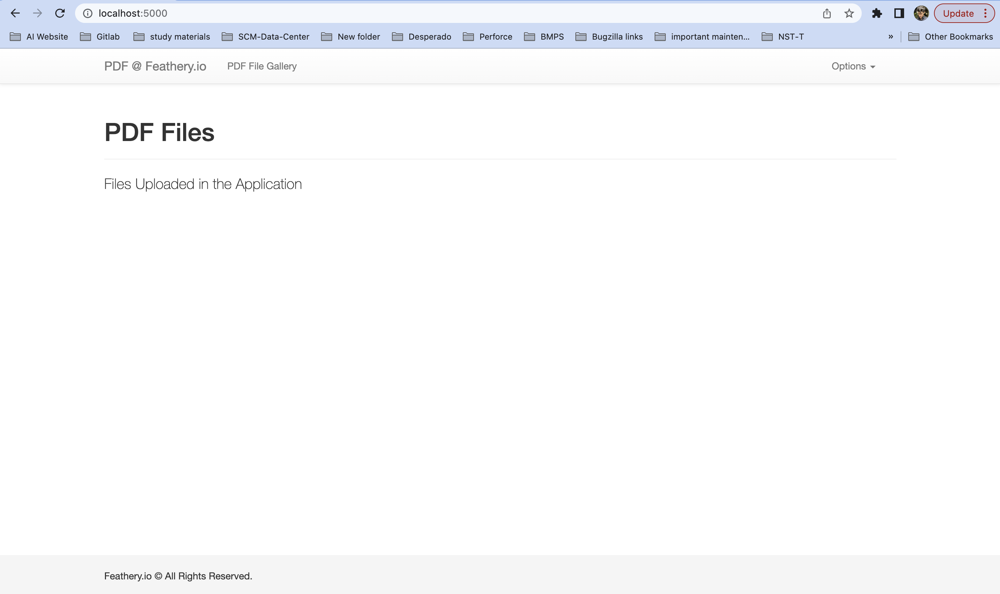
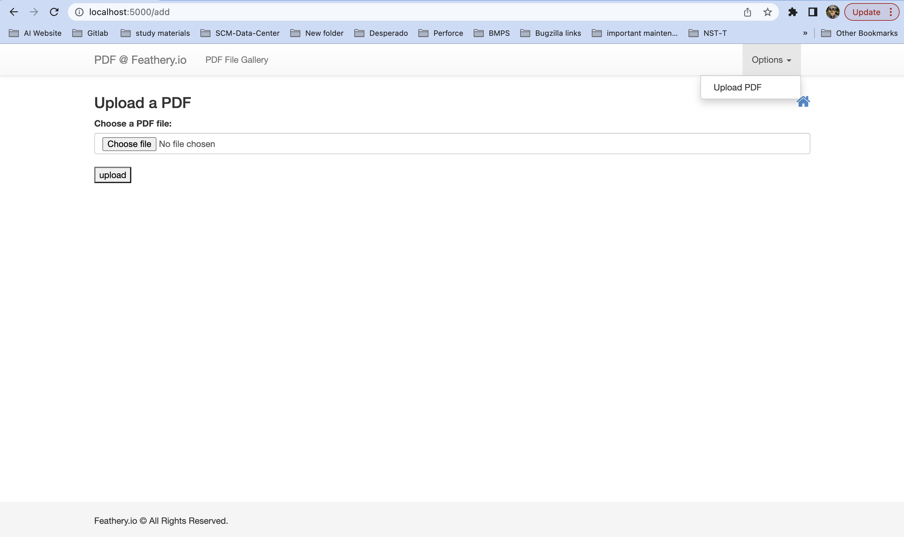
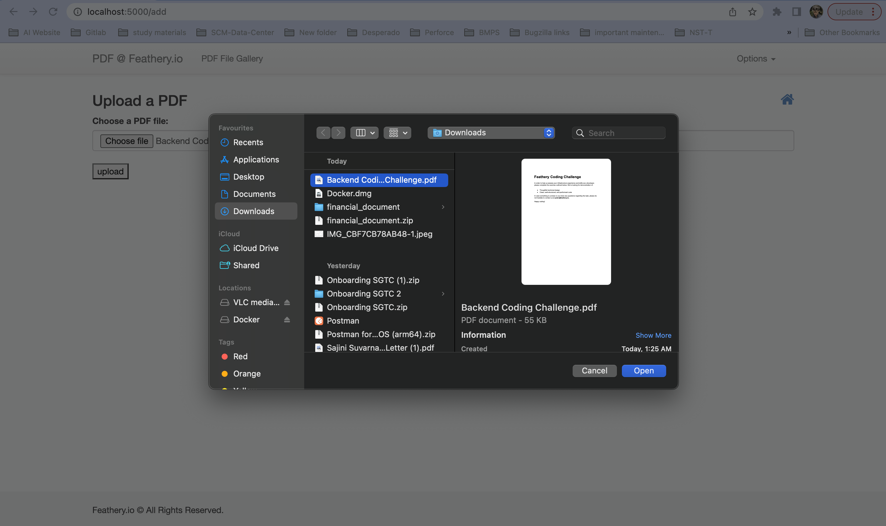
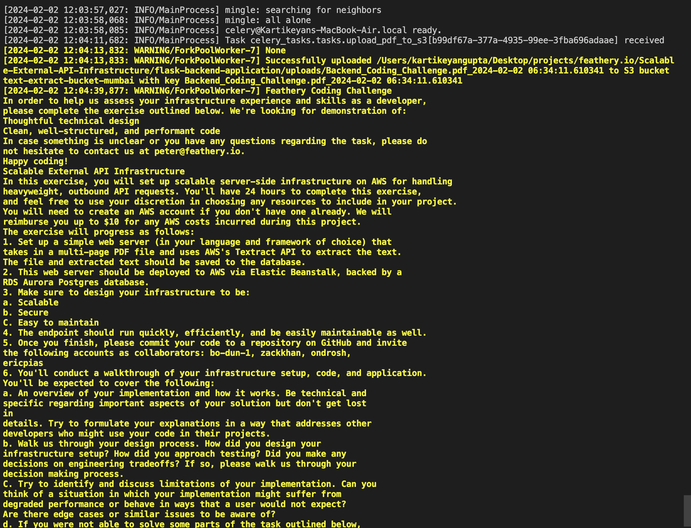
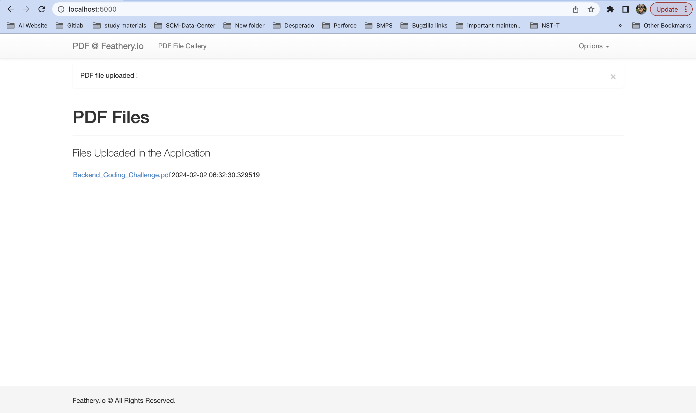
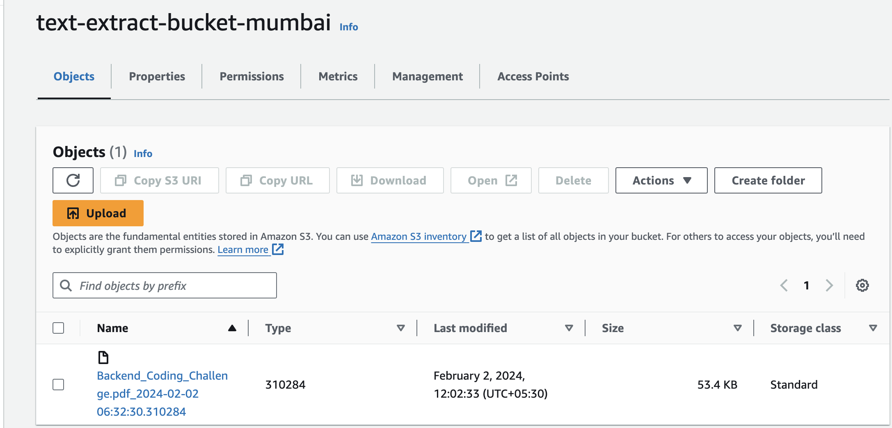
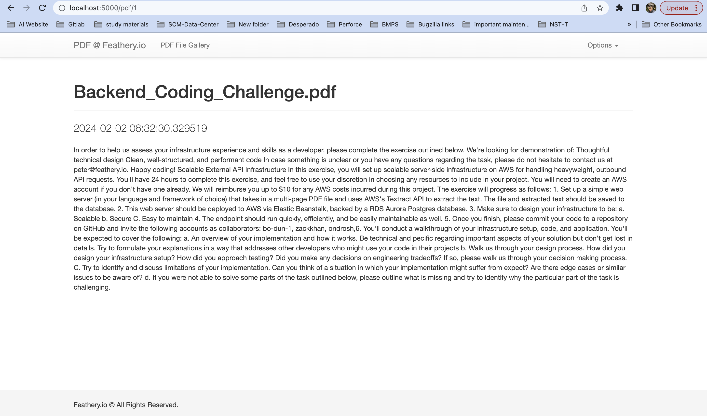

# Feathery.io Assignment

## Problem Statement 

1. Set up scalable server-side infrastructure on AWS for handling heavyweight, outbound API requests.
2. Set up a simple web server (in your language and framework of choice) that takes in a multi-page PDF file and uses AWS’s Textract API to extract the text.
3. The file and extracted text should be saved to the database.
4. This web server should be deployed to AWS via Elastic Beanstalk, backed by a RDS Aurora Postgres database.
5. The endpoint should run quickly, efficiently, and be easily maintainable as well.

## Tech Stack 

1. AWS EC2 Instance
2. Flask / Django / GoLang
2. AWS Textract API
3. AWS Elastic Beanstalk
4. RDS Aurora Postgres database

## Why Flask for API Rest Framework

Even though Django is older and has a slightly more extensive community, Flask has its strengths. From the ground up, Flask was built with scalability and simplicity. Flask applications are known for being lightweight, mainly compared to their Django counterparts. Flask developers call it a microframework, where micro means that the goal is to keep the core simple but extensible. Flask won't make many decisions for us, such as what database to use or what template engine to choose. Lastly, Flask has extensive documentation that addresses everything developers need to start. FastAPI follows a similar "micro" approach to Flask, though it provides more tools like automatic Swagger UI and is an excellent choice for APIs. However, as it is a newer framework, many more resources and libraries are compatible with frameworks like Django and Flask but not with FastAPI.

## System Design Diagram

Components:
1. Flask App
2. Celery (Asynchronous Tasks)
3. Caching system (Redis)
4. MySQL database
5. AWS Textarct
6. S3 Bucket

### Current Architecture

### Proposed with enhancements

## ScreenShots
1. Index

2. Add PDF Form

3. Celery Logs after uploading

4. Index after uploading pdf in S3.

5. Index after uploading pdf in S3.

6. Extracted text from PDF

## Things to Update in the Application
1. Add Validation on form and serializers on Rest.
2. Use SQS instead of Celery, celery importing with flask is complex and cumbersome.
3. Instead of writing a backend API to fetch text from PDF, Setup a AWS lamda that would automatically trigger everytime PDF gets uploaded in S3 Bucket.
4. Connect AWS Postgresql with the app, instead of file based SQL.
5. Write Unit test case and achieve atleast 80% of coverage.
6. Run Performance Testing using Locust.io
7. Deploy application using AWS Elastic Beanstalk.
8. Add logging, cloudwatch healthchecks, monitoring and alerting.

## Author
1.  kartikeyangupta
